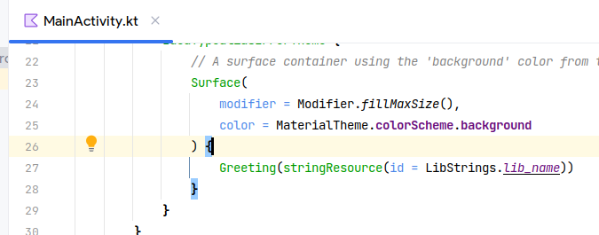
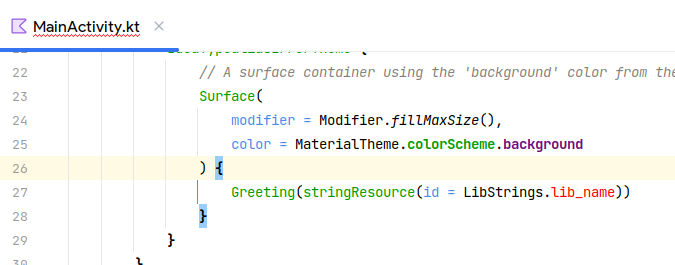

# README

This repository showcases a bug where IDEA cannot resolve resources referenced via a
Kotlin `typealias` even though the code compiles & works successfully.

The `main` branch shows that IDEA can resolve the resources when consuming a Gradle module.
The `repro` branch shows that IDEA cannot resolve the resources when consuming an Android Library
from Maven.

| `main`                              | `repro`                               |
|-------------------------------------|---------------------------------------|
|  |  |
